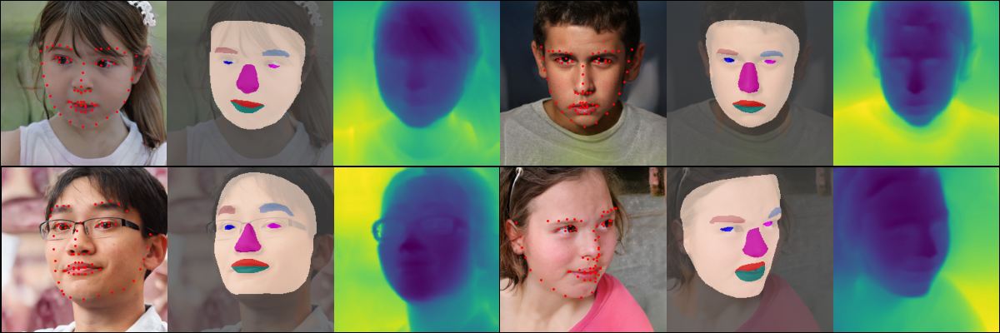

## SynthForge Data Generation



This repository contains the scripts to facilitate synthetic data generation for the paper [SynthForge: Synthesizing High-Quality Face Dataset with Controllable 3D Generative Models](https://arxiv.org/abs/2406.07840v1). Refer to the instructions below to setup the code and data. For more details, the [project page](https://synth-forge.github.io/) contains the links to the paper, generated dataset (for reproducing results in the paper), link to the training and inference code, and data samples.

## Requirements

* NVIDIA GPUs. We have done all testing and development using A100 and V100 GPUs for loading pretrained model and data generation.
* 64-bit Python 3.9 and PyTorch 1.12.0 (or later). See https://pytorch.org for PyTorch install instructions.
* Pytorch3D is used for rendering and 3D annotation extraction.
* CUDA toolkit 11.6 or later
* Python libraries: see [environment.yml](./environment.yml) for exact library dependencies.  

## Getting started

Download the Next3D pretrained models following [the link](https://drive.google.com/drive/folders/1rbR5ZJ6LQYUSd5J5BkoVYNon_-Lb7KsZ?usp=share_link) and put it under `pretrained_models`. 

Download the [FLAME](https://flame.is.tue.mpg.de/) assets and place under the `model` folder. These should contain the model pickle files, flame masks, and UV textures.

Download the [flame_pytorch](https://github.com/soubhiksanyal/FLAME_PyTorch) for generation of FLAME mesh for the dataset.


## Generating data

After setting up the code and models, we can start the data generation process. First, we need to train the alignment MLP:

```.bash
python train_alignment_mlp.py
```

This will generate the MLP weights `fixMapMLP01.pth` which is then used in the alignment pipeline, or you can use the weights already provided in the repository.

Afterwards, we need to start the data generation:

```.bash
CUDA_VISIBLE_DEVICES=0 python generate_synthforge_data.py --output_dir <path to dataset> --num_images <Number of images to dump>
```

> Change the paths in the python scripts before running to point to your asset files and model weights.

This will generate the dataset in the following format:

```.bash
.
├── annotations
|   ├── 000000.json
|   └── 000001.json
├── depth
|   ├── 000000.png
|   └── 000001.png
├── images
|   ├── 000000.png
|   └── 000001.png
└── seg
    ├── 000000.png
    └── 000001.png
```
Where the json annotations contain the flame parameters, the StyleGAN2 latent variable, the projected 3D keypoint annotations, segmentation masks, depth maps, and the RGB images.


## Citation

```
@misc{rawat2024synthforge,
      title={SynthForge: Synthesizing High-Quality Face Dataset with Controllable 3D Generative Models}, 
      author={Abhay Rawat and Shubham Dokania and Astitva Srivastava and Shuaib Ahmed and Haiwen Feng and Rahul Tallamraju},
      year={2024},
      eprint={2406.07840},
      archivePrefix={arXiv},
      primaryClass={cs.CV}
}
```

## Acknowledgements

Part of the code is borrowed from [Next3D](https://github.com/MrTornado24/Next3D) and [DECA](https://github.com/yfeng95/DECA). The code relies on [FLAME](https://flame.is.tue.mpg.de/), and [flame_pytorch](https://github.com/soubhiksanyal/FLAME_PyTorch).